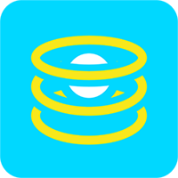

# teleport-flask-websocket
[](https://badge.fury.io/js/teleport-flask-websocket)

<table>
  <td>
    
  </td>
  <td>
    
  </td>
  <td>
    A <a href="https://github.com/snipsco/teleport"> Teleport </a> backend template to build a flask server based on sockets.
  </td>
</table>

## How to use it
Simply add it to the list of templates. For instance:
```
tpt -c --templates teleport-flask-websocket,teleport-heroku
```
